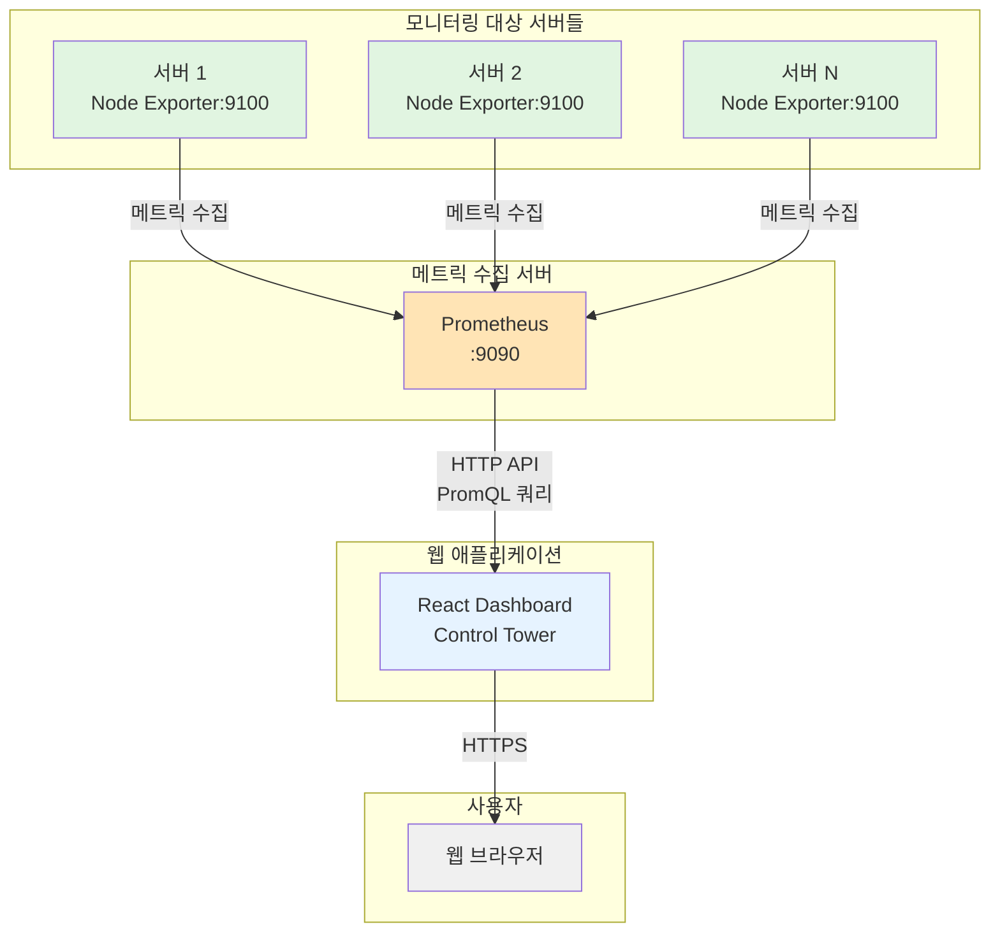

# Control Tower - 서버 모니터링 대시보드

실시간 서버 모니터링을 위한 웹 기반 대시보드 시스템입니다. Prometheus와 Node Exporter를 기반으로 서버 메트릭을 수집하고 시각화합니다.

## 📊 시스템 아키텍처



## 🚀 주요 기능

### 1. 실시간 서버 모니터링
- **CPU 사용률**: 실시간 CPU 사용량 모니터링
- **메모리 사용률**: 전체 메모리 대비 사용 중인 메모리 비율
- **디스크 사용률**: 파일시스템별 디스크 사용량 (tmpfs 등 임시 파일시스템 제외)
- **네트워크 I/O**: 네트워크 송수신 속도 (MB/s)
- **업타임**: 서버 가동 시간

### 2. 대시보드 기능
- **메인 대시보드**: 전체 서버 상태를 한눈에 확인
  - 서버별 카드 형태로 주요 메트릭 표시
  - 상태별 서버 수 집계 (정상/경고/오프라인)
  - 30초 자동 새로고침
  
- **서버 상세 페이지**: 개별 서버의 상세 메트릭
  - 24시간 시계열 그래프
  - 실시간 메트릭 업데이트
  - 상세 리소스 사용량 정보

### 3. 알림 및 상태 표시
- **상태 구분**:
  - 🟢 정상 (Online): 모든 메트릭이 정상 범위
  - 🟡 경고 (Warning): CPU/메모리/디스크 중 하나라도 90% 초과
  - 🔴 오프라인 (Offline): 서버 응답 없음

## 🛠 기술 스택

### Frontend
- **React** 18.x with TypeScript
- **TanStack Query**: 서버 상태 관리 및 캐싱
- **React Router**: 라우팅
- **Tailwind CSS**: 스타일링
- **Recharts**: 차트 라이브러리
- **Lucide React**: 아이콘

### Monitoring Stack
- **Prometheus**: 메트릭 수집 및 저장
- **Node Exporter**: 서버 메트릭 익스포터

## 📁 프로젝트 구조

```
controll-tower/
├── controll-view/              # React 프론트엔드
│   ├── src/
│   │   ├── components/         # 재사용 가능한 컴포넌트
│   │   │   ├── ServerCard.tsx  # 서버 카드 컴포넌트
│   │   │   ├── MetricChart.tsx # 메트릭 차트 컴포넌트
│   │   │   └── DebugMetrics.tsx
│   │   ├── pages/              # 페이지 컴포넌트
│   │   │   ├── MainDashboard.tsx
│   │   │   └── ServerDetail.tsx
│   │   ├── hooks/              # 커스텀 훅
│   │   │   └── usePrometheus.ts
│   │   ├── utils/              # 유틸리티 함수
│   │   │   └── prometheus.ts   # Prometheus API 통신
│   │   ├── types/              # TypeScript 타입 정의
│   │   │   └── prometheus.ts
│   │   └── App.tsx             # 메인 앱 컴포넌트
│   ├── .env                    # 환경변수 설정
│   └── package.json
└── README.md
```

## 🔧 설치 및 실행

### 사전 요구사항
- Node.js 16.x 이상
- npm 또는 yarn
- Prometheus 서버 (메트릭 수집용)
- 모니터링할 서버에 Node Exporter 설치

### 설치 방법

1. 저장소 클론
```bash
git clone https://github.com/your-username/controll-tower.git
cd controll-tower/controll-view
```

2. 의존성 설치
```bash
npm install
```

3. 환경변수 설정
```bash
cp .env.example .env
# .env 파일을 열어 REACT_APP_PROMETHEUS_URL 설정
```

4. 개발 서버 실행
```bash
npm start
```

5. 프로덕션 빌드
```bash
npm run build
```

## ⚙️ 환경 설정

### Prometheus 설정 예시

`prometheus.yml`:
```yaml
global:
  scrape_interval: 15s

scrape_configs:
  - job_name: 'node'
    static_configs:
      - targets: 
        - 'server1.example.com:9100'
        - 'server2.example.com:9100'
        labels:
          alias: '개발 서버 1'
      - targets:
        - 'server3.example.com:9100'
        labels:
          alias: '개발 서버 2'
```

### Node Exporter 설치

각 모니터링 대상 서버에서:
```bash
# Node Exporter 다운로드 및 설치
wget https://github.com/prometheus/node_exporter/releases/download/v1.7.0/node_exporter-1.7.0.linux-amd64.tar.gz
tar xvfz node_exporter-1.7.0.linux-amd64.tar.gz
cd node_exporter-1.7.0.linux-amd64
./node_exporter
```

## 📊 수집 메트릭 상세

### CPU 메트릭
- **쿼리**: `100 - (avg(irate(node_cpu_seconds_total{mode="idle"}[5m])) * 100)`
- **설명**: 5분간 평균 CPU 사용률 (idle 시간 제외)

### 메모리 메트릭
- **사용률**: `(1 - (node_memory_MemAvailable_bytes / node_memory_MemTotal_bytes)) * 100`
- **전체 용량**: `node_memory_MemTotal_bytes`
- **사용 중**: `node_memory_MemTotal_bytes - node_memory_MemAvailable_bytes`

### 디스크 메트릭
- **사용률**: 실제 파일시스템만 계산 (tmpfs, devtmpfs 등 제외)
- **쿼리**: 
```promql
sum(node_filesystem_size_bytes{fstype!~"tmpfs|devtmpfs|iso9660|squashfs"} - 
    node_filesystem_avail_bytes{fstype!~"tmpfs|devtmpfs|iso9660|squashfs"}) / 
sum(node_filesystem_size_bytes{fstype!~"tmpfs|devtmpfs|iso9660|squashfs"}) * 100
```

### 네트워크 메트릭
- **수신**: `rate(node_network_receive_bytes_total{device!="lo"}[5m])`
- **송신**: `rate(node_network_transmit_bytes_total{device!="lo"}[5m])`

## 🚨 알려진 문제점

### HTTPS/CORS 이슈
- HTTPS로 서비스할 때 HTTP Prometheus API 직접 호출 불가 (Mixed Content)
- 해결 방안:
  1. Prometheus를 HTTPS로 설정
  2. 백엔드 프록시 서버 구축
  3. 리버스 프록시 사용 (nginx 등)

## 🤝 기여하기

1. Fork the Project
2. Create your Feature Branch (`git checkout -b feature/AmazingFeature`)
3. Commit your Changes (`git commit -m 'Add some AmazingFeature'`)
4. Push to the Branch (`git push origin feature/AmazingFeature`)
5. Open a Pull Request

## 📝 라이선스

MIT License - 자세한 내용은 [LICENSE](LICENSE) 파일을 참조하세요.

